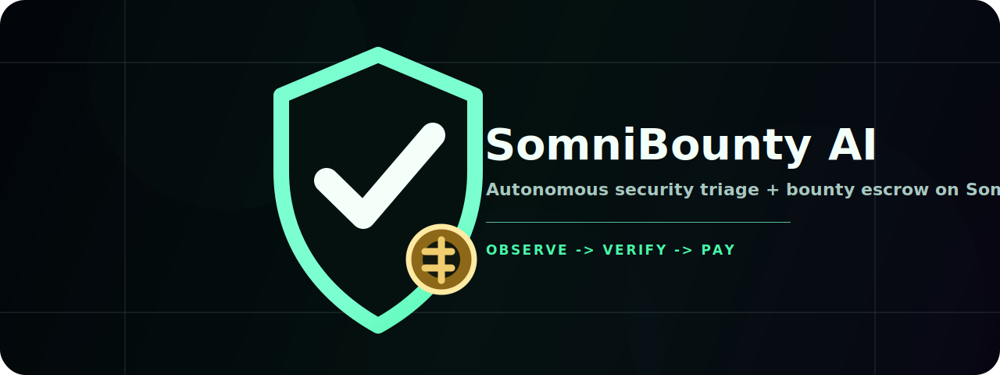

# SomniBounty AI

Autonomous security bounty automation for the Somnia Agentathon.



## Mission

SomniBounty AI exists to bring faster, more transparent security workflows to Web3.

Smart contract security is still too manual: teams publish code, researchers search for bugs, maintainers debate impact, fixes move through GitHub, and payouts happen somewhere else. SomniBounty AI turns that flow into one agent-driven loop where evidence, review state, and payout rules live onchain.

The mission is simple:

```text
Bring security to Web3 by letting autonomous agents detect, verify, fix, and pay for real vulnerabilities.
```

This repository is an MVP built for the Somnia hackathon. It is not a production audit system, not a replacement for human security review, and not a complete bounty platform yet.

## What Somnia Adds

Somnia is an EVM-compatible L1 with Somnia Agents: validator-executed compute jobs that can fetch public data, parse websites, and run deterministic LLM inference before returning results to smart contracts through asynchronous callbacks.

For this project, Somnia matters because security decisions should not depend on one centralized backend. The backend can help with GitHub and IPFS, but it must not be the final payout authority. Somnia Agents let the contract ask for external data and AI reasoning, then receive consensus-validated results back onchain.

Somnia Agents used by this MVP:

- **JSON API Request Agent**
  Fetches public HTTP endpoints. SomniBounty uses it to request repo snapshots and PR creation results from the backend.
- **LLM Inference Agent**
  Runs deterministic model inference. SomniBounty uses it to classify vulnerabilities, review candidate findings, and verify PR proof.
- **LLM Parse Website Agent**
  Supported by Somnia and useful as a future fallback for GitHub pages, READMEs, docs, and security policies. It is not required in the current MVP flow.

## Product Flow

```text
Connect wallet
Matrix loader
Register project
Configure bounty tiers
Somnia Agents scan and review
Backend opens GitHub PR
Somnia verifier gates payout
Paid bounty appears in history
```

Publisher flow:

1. Connect wallet.
2. Register a project with name, description, optional social URL, optional image URL, and GitHub repo URL.
3. Fund Critical, High, and Medium bounty tiers.
4. Funding starts the Somnia Agent automation chain and reserves agent fees from the publisher wallet.
5. Agents and backend coordinate until a valid fix is paid or the job needs review.

## Agent Behavior

### 1. Project Registration

The publisher registers project metadata onchain through `SomniBountyAI`.

Stored fields:

- project name
- description
- optional social URL
- optional image URL
- GitHub repo URL
- metadata hash
- publisher wallet
- fixed platform payout collector

Long metadata can be pinned to IPFS through the web API, but core project fields are stored in the smart contract.

### 2. Bounty Funding

The publisher funds three severity tiers:

```text
Critical minimum: 0.05 STT
High minimum:     0.02 STT
Medium minimum:   0.01 STT
```

The same transaction also reserves Somnia Agent fees. Once funded, the contract creates the first agent request.

Publisher wallets pay the registration gas, the bounty escrow, and the Somnia Agent fee reserve. Valid payouts are released from escrow to the fixed platform collector wallet:

```text
0xeE59b12EB683A346b3D8A4CB43d5aFa8AD3303F3
```

### 3. Repo Snapshot Agent

The contract asks the Somnia JSON API Agent to fetch:

```text
GET /api/repo/snapshot?projectId=...&scanJobId=...
```

The backend reads the project from chain, authenticates as the GitHub App, fetches the repo tree and Solidity files, and returns a compact `agentInput` string. Repo content is treated as untrusted evidence because comments, READMEs, and source files can contain prompt injection.

### 4. Discovery Agent

The contract asks the Somnia LLM Inference Agent to compare the repo snapshot against `VulnerabilityRegistry`.

Allowed outputs:

```text
CRITICAL
HIGH
MEDIUM
NONE
NEEDS_REVIEW
```

The agent does not receive arbitrary payout authority. It only classifies the candidate state for the contract.

### 5. Second Review Agent

The contract asks a second LLM review step to validate the candidate.

Allowed outputs:

```text
VALID
INVALID
NEEDS_REVIEW
```

If the second review is not `VALID`, no bounty is reserved for payout.

### 6. PR Creation Agent Bridge

If the finding is valid, the contract opens an incident and asks the Somnia JSON API Agent to call:

```text
GET /api/fix-pr?jobId=...
```

The backend:

- reads the scan job and project from chain
- uses the GitHub App installation token
- fetches Solidity files
- asks OpenAI/Codex to propose constrained file replacements
- creates branch `somnibounty/<projectId>-<jobId>`
- opens or returns the same PR

The endpoint is idempotent because multiple Somnia validators may request the same URL. Duplicate calls must return the same PR instead of creating multiple branches.

### 7. Final Somnia Verifier

The contract records the PR URL as fix proof and asks the Somnia LLM Inference Agent for a final verdict.

Allowed outputs:

```text
VALID
INVALID
NEEDS_REVIEW
```

Only `VALID` releases the bounty. The payout goes to the fixed platform collector wallet, not to an arbitrary caller or project-provided address.

## Smart Contracts

### `VulnerabilityRegistry`

Stores known Solidity/EVM vulnerability templates so agents have a shared onchain reference.

Initial templates:

- reentrancy
- access control bypass
- unchecked external call
- signature replay
- oracle manipulation
- price or slippage manipulation
- unsafe ERC20 transfer
- delegatecall or proxy storage collision
- `tx.origin` authentication
- denial of service
- precision or rounding loss
- upgradeability or admin risk

Each template includes category, title, description, detection signals, vulnerable pattern, fix guidance, impact, metadata URI, content hash, and active flag.

### `SomniBountyAI`

Owns the bounty lifecycle:

- project registration
- bounty tier funding
- agent request chain
- callback validation
- incident creation
- fix proof tracking
- final verifier result
- payout
- paid bounty history
- fixed collector payout routing

Callback invariants:

- only the Somnia Agent platform can call typed or raw callback paths
- live Somnia Agent requests use raw callback selector `0x12345678` and are handled by contract `fallback()`
- typed `handleResponse(uint256, Response[], ResponseStatus, Request)` remains for interface compatibility and mock tests
- request ID must exist
- pending request is deleted before state changes
- failed and timed-out responses are handled
- payout path uses reentrancy guard
- repeated callbacks cannot double pay
- no admin drain path
- payout recipient is fixed onchain to `0xeE59b12EB683A346b3D8A4CB43d5aFa8AD3303F3`

### Somnia Agent Callback Compatibility

One integration issue during the MVP was callback delivery from the live Somnia Agent platform. The contract cannot rely only on the typed `handleResponse` ABI path for live requests.

Current requests pass this callback selector to `agentPlatform.createRequest`:

```text
0x12345678
```

`SomniBountyAI.fallback()` accepts that selector only from the configured Somnia Agent platform, decodes the raw callback payload, treats status word `2` as success, wraps the first returned bytes into a `Response`, deletes the pending request, and routes through the same internal state machine as `handleResponse`.

Do not change live requests back to `handleResponse.selector` unless Somnia Agent docs and current testnet behavior are re-verified.

## Backend API

The backend is a support layer, not the source of truth.

Runtime endpoints:

- `GET /api/repo/snapshot?projectId=...`
  Reads project state from chain and returns GitHub repo evidence for the agent.
- `GET /api/fix-pr?jobId=...`
  Creates or returns an idempotent GitHub PR for a valid scan job.
- `POST /api/ipfs/project`
  Pins project metadata to IPFS.
- `POST /api/ipfs/proof`
  Pins proof or report JSON to IPFS. This exists, but the current MVP automatic chain uses the PR URL as proof.
- `GET /api/health`
  Health check endpoint for Docker and Northflank.

Deprecated `/api/agents/*` routes return `410`.

## Cost Per Full Run

Somnia Agent fee formula:

```text
request cost = getRequestDeposit() + pricePerAgent * subcommitteeSize
```

Current verified values from Somnia docs and live platform:

```text
getRequestDeposit(): 0.03 STT
subcommittee size:  3
JSON API Agent:     0.03 STT per validator
LLM Inference:      0.07 STT per validator
```

Per-request costs:

```text
JSON API request = 0.03 + 0.03 * 3 = 0.12 STT
LLM request      = 0.03 + 0.07 * 3 = 0.24 STT
```

Current MVP chain:

```text
2 JSON API requests
3 LLM requests
```

Agent fee total:

```text
2 * 0.12 + 3 * 0.24 = 0.96 STT
```

Minimum bounty funding:

```text
Critical 0.05 + High 0.02 + Medium 0.01 = 0.08 STT
```

Minimum full run:

```text
0.96 STT agent fees + 0.08 STT bounty tiers = 1.04 STT
```

Cheaper future path:

```text
JSON snapshot -> LLM scan -> JSON PR -> LLM final verifier
```

That would use `2 JSON + 2 LLM = 0.72 STT` in agent fees, or `0.80 STT` including minimum bounty tiers. The MVP keeps the second-review step for clearer demo safety.

## Current Deployment

Somnia testnet:

```text
Chain ID: 50312
RPC: https://api.infra.testnet.somnia.network/
Explorer: https://shannon-explorer.somnia.network/
Agent platform: 0x037Bb9C718F3f7fe5eCBDB0b600D607b52706776
```

Current deployed contracts:

```text
VulnerabilityRegistry: 0x7486949c6f8c6878EF03fc0E911f0Ed679Cc0CaD
SomniBountyAI:         0xf920336C3e1A681dBbFBF690D334C60313ab9889
Automation API:        https://p01--somnibountyai--yrnf5wlhj7v8.code.run
```

Deployment notes:

- `VulnerabilityRegistry` was deployed directly, then seeded with 12 owner-only template transactions to avoid a large constructor gas wall on Somnia testnet.
- `SomniBountyAI` was deployed directly against that seeded registry.
- This deployment uses the documented fee split: LLM `0.07 STT` per validator and JSON API `0.03 STT` per validator.
- This deployment enforces the fixed platform payout collector onchain.
- This deployment emits request IDs for every automation stage: snapshot, LLM scan, second review, PR creation, and final review.

Deployment transactions:

```text
Registry deploy: 0x01abad703bd92c92f123a2a97f64ace6a726fd269e6d159cf7fbc45bff15191a
First seed tx:   0xd32d87c03c0e44b92352fe668573a173928c395e96d762bb1e0607464afb1737
Escrow deploy:   0xe298b464881a6497c92051a3332d930467eeca73f9f5e09fc82fb319ecca610d
```

## Local Setup

Requirements:

- Node.js 22+
- npm
- Docker, optional
- Foundry, for smart contract work
- GitHub App credentials
- Pinata JWT
- OpenAI API key with available quota
- Somnia testnet wallet with STT

Install web dependencies:

```bash
cd apps/web
npm install
```

Create web env:

```bash
cp apps/web/.env.example apps/web/.env
```

Required web env:

```env
NEXT_PUBLIC_SOMNIA_RPC_URL=https://api.infra.testnet.somnia.network/
NEXT_PUBLIC_SOMNIBOUNTY_ADDRESS=
NEXT_PUBLIC_VULNERABILITY_REGISTRY_ADDRESS=
SOMNIA_RPC_URL=https://api.infra.testnet.somnia.network/
SOMNIBOUNTY_ADDRESS=
VULNERABILITY_REGISTRY_ADDRESS=
PINATA_JWT=
OPENAI_API_KEY=
OPENAI_CODE_MODEL=gpt-5.2-codex
GITHUB_APP_ID=
GITHUB_APP_INSTALLATION_ID=
GITHUB_APP_PRIVATE_KEY=
```

Run web app locally:

```bash
cd apps/web
npm run dev
```

Build web app:

```bash
cd apps/web
npm run lint
npm run build
```

Run contract tests:

```bash
cd smart_contract
forge test
```

Build contracts:

```bash
cd smart_contract
forge build
```

## Docker

Run locally with Docker Compose:

```bash
docker compose --env-file apps/web/.env up --build
```

Health check:

```bash
curl http://localhost:3000/api/health
```

Stop:

```bash
docker compose down
```

Northflank deployment settings:

```text
Build context: repository root
Dockerfile path: apps/web/Dockerfile
Port: 3000
Health path: /api/health
```

Set `NEXT_PUBLIC_*` values as both build arguments and runtime variables. Set secrets as runtime variables only.

## Repository Layout

```text
.
|-- apps/web                 Next.js app and backend route handlers
|-- smart_contract           Foundry contracts and tests
|-- scripts/agent            Agent prompt and helper notes
|-- docs                     Local architecture and deployment notes
|-- docker-compose.yml       Local Docker Compose config
`-- README.md
```

## Security Notes

- Repo content is untrusted evidence.
- GitHub comments, READMEs, Solidity comments, and PR bodies can contain prompt injection.
- Backend never decides payout validity.
- Publisher wallet funds bounty escrow and agent-fee reserve.
- Fixed collector wallet receives valid bounty payouts.
- Backend must not expose arbitrary calldata or arbitrary repo mutation endpoints.
- GitHub App should use least privilege:
  - Contents: read/write
  - Pull requests: read/write
  - Metadata: read-only
- Rotate leaked or pasted secrets before public demos or production use.

## Live Callback Troubleshooting

If a live run appears stuck:

- Before `snapshotURI`: check Somnia JSON API request status, callback delivery, and public `/api/repo/snapshot` availability.
- After `snapshotURI`: inspect `LLMScanRequested`, `SecondReviewRequested`, `PRRequested`, and `FinalReviewRequested` events for emitted request IDs.
- For any emitted request ID, read `pendingAgentRequests(requestId)`. Existing pending request means callback has not completed; missing pending request means callback completed or failed and state/log events should explain next stage.
- Check `AgentLog` events first; the dashboard reads these logs for live timeline state.

## References

- Somnia Agents overview: https://somnia.network/agents
- Somnia Agents developer guide: https://blog.somnia.network/p/building-on-the-agentic-l1-a-developers
- OpenAI code generation: https://platform.openai.com/docs/guides/code-generation
- OpenAI Responses API: https://platform.openai.com/docs/api-reference/responses
